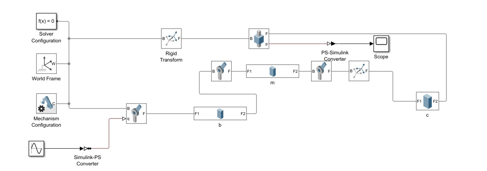

# Apuntes-Sexta semana
Apuntes control de movimiento - Segundo Corte-Sexta Semana

## 1. Diseño de Eslabones en Simulink
El diseño de eslabones en Simulink con Simscape Multibody permite modelar sistemas mecánicos compuestos por cuerpos rígidos conectados mediante articulaciones. Un eslabón es una pieza mecánica que transmite movimiento o fuerza dentro de un mecanismo, como en un brazo robótico, una biela-manivela o una suspensión automotriz.

En Simulink, cada eslabón se representa mediante un bloque Solid, donde se definen sus propiedades físicas como masa, forma y dimensiones. Los eslabones se conectan mediante juntas (como Revolute Joint o Prismatic Joint), que permiten definir los grados de libertad del sistema. Además, podemos aplicar fuerzas o torques para simular el comportamiento dinámico del mecanismo.

>🔑 *Revolute Joint:* es una articulación rotacional que permite que dos cuerpos giren uno respecto al otro en un solo eje. Es equivalente a una bisagra o a un eje de rotación en un sistema mecánico real, como el codo de un brazo robótico o la unión entre la biela y la manivela de un motor.

>🔑 *Primatic Joint:* es una articulación que permite el movimiento lineal (traslacional) entre dos cuerpos a lo largo de un solo eje, restringiendo todas las demás formas de movimiento. Es como una guía deslizante, un pistón, o el eje de un actuador lineal.

## 2. Bloque PS Converter en Simulink

El bloque PS Converter en Simulink se utiliza para convertir una señal del entorno de Simulink en una señal física (Physical Signal, PS). Esta conversión es esencial cuando se desea utilizar una señal matemática, como una onda senoidal, dentro de un modelo físico en Simscape.

Gracias a esta conversión, la señal puede ser conectada a bloques de Simscape que solo aceptan señales físicas, como por ejemplo:

* Fuentes de Simscape: para aplicar fuerzas, voltajes o torques.

* Joints con movimiento prescrito: para definir el desplazamiento o rotación de un cuerpo.

* Sensores físicos: para controlar o medir variables físicas dentro del modelo.

De esta manera, el PS Converter actúa como un puente entre el mundo matemático de Simulink y el mundo físico de Simscape, permitiendo la interacción y simulación conjunta de ambos entornos.

## 3. Conceptos claves

* Grados de Libertad (DOF): Un eslabón rotacional tiene un solo grado de libertad, lo que significa que puede rotar alrededor de un eje específico.

* Juntas Rotacionales: En Simulink, se usa el bloque "Revolute Joint" de Simscape Multibody para modelar una articulación rotacional.

* Par/Torque y Movimiento: Se pueden aplicar torques o definir movimientos preestablecidos a los eslabones.

* Sensores y Actuadores: Se pueden agregar sensores para medir ángulos y velocidades angulares, así como actuadores para controlar la rotación.

## 4. Ejercicios

### Ejemplo Biela Manivela

Este mecanismo clásico puede modelarse con tres cuerpos rígidos: manivela, biela y pistón.

La Figura 1 presenta una simulación realizada en Simulink y Simscape Multibody de un sistema mecánico tradicional compuesto por manivela, biela y corredera. Este tipo de mecanismo es común en dispositivos como motores de combustión interna y compresores, debido a su capacidad para transformar un movimiento giratorio en uno rectilíneo.

*Fig 1. Ejemplo*

**Organización del Modelo**

El modelo ha sido desarrollado utilizando bloques esenciales de Simscape Multibody, que permiten una representación precisa del comportamiento físico del sistema:

* Solver Configuration: Se encarga de definir el tipo de solucionador que se utilizará para ejecutar la simulación.

* World Frame: Proporciona un marco de referencia fijo e inercial para el sistema.

* Mechanism Configuration: Permite establecer condiciones globales como la dirección y magnitud de la gravedad.

* Simulink-PS Converter: Convierte señales generadas en Simulink (como una señal senoidal) al entorno físico de Simscape.

* PS-Simulink Converter: Transforma señales físicas de salida en señales que pueden ser interpretadas por bloques de Simulink para visualización (como el Scope).

**Descripción de los Componentes**

*Manivela*

* Representada por un cuerpo sólido que gira en torno a un eje fijo mediante una junta rotacional (Revolute Joint).

* Su rotación es inducida por una señal senoidal, que simula el funcionamiento de un eje motriz.

*Biela*

* Conecta la manivela con la corredera utilizando dos Revolute Joints.

* Su función principal es transmitir el movimiento rotacional de la manivela y convertirlo en desplazamiento lineal que será aplicado a la corredera.

*Corredera*

* Elemento que se mueve en línea recta a lo largo de un solo eje, restringido por una junta prismática (Prismatic Joint).

* El desplazamiento de la corredera se visualiza mediante un bloque Scope de Simulink.

*Rigid Transform*

* Permite posicionar y orientar adecuadamente los cuerpos rígidos dentro del entorno tridimensional del modelo.

**Principio de Funcionamiento**

El sistema convierte el giro oscilante de la manivela, generado por la señal de entrada, en un movimiento lineal alternativo en la corredera. La biela es el vínculo intermedio que transmite y adapta este movimiento entre ambos componentes.

Esta simulación resulta útil tanto para evaluar diseños mecánicos como para analizar el comportamiento dinámico del mecanismo bajo diferentes condiciones de entrada.

**Visualización de Resultados**

La Figura 2 muestran capturas del modelo durante la simulación. En estas imágenes se pueden distinguir claramente los tres elementos principales:

* La manivela (representada en naranj, a la izquierda),

* La biela (en azul, ubicada en el centro),

* La corredera (en morado, a la derecha).

Estas vistas permiten apreciar el comportamiento dinámico del mecanismo y cómo interactúan sus componentes a lo largo del ciclo de operación.

*Fig 2. Diseño Final Ejemplo 1*

**Observaciones de la Animación**

Durante la animación del modelo, se pueden apreciar los siguientes aspectos clave del funcionamiento del mecanismo:

* El conjunto de cuerpos rígidos responde de forma fluida y continua a la señal senoidal aplicada como entrada.

* La biela desempeña el papel de eslabón dinámico, adaptando constantemente su orientación para sincronizar tanto con el movimiento giratorio de la manivela como con el desplazamiento lineal de la corredera.

* Todo el sistema opera de manera coordinada, replicando con alta fidelidad un ciclo mecánico completo, similar al que se produce en el funcionamiento de un pistón dentro de un motor de combustión interna.

### Ejemplo Prismático

A continuación, se expone un ejemplo de simulación mecánica diseñado para ilustrar el comportamiento dinámico de un cubo en movimiento. Este modelo tiene como propósito aplicar los conceptos previamente abordados, tales como cuerpos rígidos, juntas mecánicas y señales físicas, todo ello dentro del entorno de Simulink y Simscape Multibody.

En este caso particular, el sistema simula un movimiento vertical oscilatorio del cubo, que se manifiesta como un desplazamiento alternante hacia arriba y hacia abajo a lo largo de un único eje, es decir, un movimiento lineal unidimensional. Este patrón de movimiento se implementa mediante una Prismatic Joint, que limita el desplazamiento del cuerpo rígido a un solo grado de libertad en línea recta.

El movimiento oscilatorio del cubo se genera a partir de una señal senoidal física, la cual se obtiene desde una señal convencional de Simulink utilizando un bloque Simulink-PS Converter. Esto permite controlar la frecuencia y amplitud del movimiento, generando un desplazamiento cíclico y continuo.

A partir del diagrama que se presenta a continuación, se ofrecerá una descripción breve del sistema, detallando sus elementos principales y el modo en que interactúan dentro del entorno de simulación.

*Fig 3. Ejemplo*

**Esquema Básico de Simulación en Simscape Multibody**

El siguiente esquema representa una configuración elemental dentro de Simscape Multibody, diseñada para simular el comportamiento mecánico de un cuerpo rígido en movimiento oscilatorio vertical. Este modelo emplea bloques esenciales que permiten visualizar y analizar el desplazamiento de un cubo bajo una entrada senoidal. A continuación, se detallan los elementos principales que componen el sistema:

*Solver Configuration, World Frame y Mechanism Configuration*

Estos tres bloques forman el conjunto mínimo indispensable para iniciar una simulación física en Simscape Multibody.

* Solver Configuration establece los parámetros necesarios para el solucionador numérico.

* World Frame define el sistema de coordenadas global, actuando como referencia inercial.

* Mechanism Configuration permite configurar aspectos generales del modelo, como la dirección de la gravedad.

*Sine Wave*

Este bloque genera una señal senoidal que determina el patrón de movimiento deseado.

* Dicha señal representa un desplazamiento periódico que imita un comportamiento de subida y bajada constante, el cual será aplicado al sistema.

*Simulink-PS Converter*

* Convierte la señal senoidal producida en Simulink a una señal física compatible con Simscape, haciendo posible su conexión directa con elementos del entorno físico, como las juntas o bloques mecánicos.

*Prismatic Joint*

Permite definir un grado de libertad lineal entre dos cuerpos.

* En este caso, restringe el movimiento del cubo para que solo pueda desplazarse verticalmente a lo largo de un único eje, lo que permite representar un movimiento puramente traslacional.

*Brick Solid*

Representa el cuerpo rígido dentro de la simulación (el cubo).

* En este bloque se configuran propiedades físicas del objeto como su forma geométrica, tamaño y masa, necesarias para su correcto comportamiento dinámico en el entorno de simulación.

**Simulación del Movimiento**

Durante la simulación, se puede apreciar el comportamiento dinámico del cubo modelado mediante el bloque Solid. Este cuerpo rígido está conectado a una junta prismática (Prismatic Joint), la cual restringe su movimiento exclusivamente al eje vertical (eje Y), permitiendo únicamente desplazamientos lineales en esa dirección.

La señal senoidal aplicada como entrada a la junta prismática genera un movimiento de oscilación vertical en el cubo, el cual sube y baja de manera cíclica con el paso del tiempo. Este comportamiento refleja un patrón de traslación alternante controlado por los parámetros de frecuencia y amplitud definidos en la señal.

**Observaciones de la Animación**

La animación generada durante la simulación permite observar con claridad el comportamiento del cubo bajo la acción de la señal de entrada. Se destacan los siguientes aspectos:

*El cubo realiza un movimiento ascendente y descendente suave, directamente influenciado por la amplitud y frecuencia de la señal senoidal configurada.

*Su trayectoria permanece perfectamente alineada con el eje Y, lo cual es posible gracias a las restricciones impuestas por la junta prismática, que limita el desplazamiento a un único eje.

*La respuesta del sistema es continua y precisa, evidenciando una integración efectiva entre los componentes físicos del entorno Simscape y las señales generadas desde Simulink.

Estos resultados confirman que el modelo ha sido correctamente configurado, validando su capacidad para representar de forma realista un sistema físico con movimiento oscilatorio controlado.

*Fig 4. Diseño Final Ejemplo 1*

### Ejemplo Revolute Join

Un modelo que incluye tres eslabones unidos de forma secuencial mediante juntas rotacionales (Revolute Joints) permite simular con precisión el funcionamiento de sistemas articulados, tales como brazos robóticos, manipuladores o extremidades mecánicas.

La Figura 5 muestra un mecanismo formado por tres eslabones conectados entre sí a través de juntas rotacionales. Esta disposición es típica en estructuras articuladas empleadas en aplicaciones como brazos robóticos y manipuladores.

*Fig 5. Esquema del Sistema*

**Componentes del Modelo**

* Solver Configuration: Establece los parámetros necesarios para resolver el modelo físico durante la simulación.

* World Frame: Define el sistema de coordenadas global usado como referencia en el modelo.

* Mechanism Configuration: Permite ajustar características físicas del entorno, como la presencia de gravedad.

* Rigid Transform: Determina la posición inicial del primer eslabón en relación con el marco global.

**Estructura del Mecanismo**

Eslabón 1:
* Está conectado al World Frame a través de una Revolute Joint, lo que permite el primer grado de rotación del sistema, funcionando como una base giratoria.

Eslabón 2:
* Se une al extremo del primer eslabón mediante una segunda Revolute Joint, permitiendo el movimiento relativo entre ambos. Un bloque de sólido define su forma y masa.

Eslabón 3:
* Este último eslabón está vinculado al segundo mediante una tercera Revolute Joint y actúa como el extremo libre o efector final del mecanismo.

**Funcionamiento del Sistema**

* Movimiento rotacional: Las juntas rotacionales permiten aplicar un control de rotación individual a cada eslabón.

* Detección angular: Sensores ubicados en las articulaciones proporcionan información sobre los ángulos de cada junta.

* Visualización de resultados: La señal angular de alguna de las juntas se dirige a un bloque Scope mediante un conversor PS-Simulink, lo que permite observar la respuesta dinámica del sistema.

La Figura 6 muestran la simulación de un mecanismo conformado por tres eslabones unidos mediante juntas rotacionales (Revolute Joints). Este tipo de sistema puede interpretarse como una representación conceptual de un brazo robótico en funcionamiento, donde cada eslabón realiza movimientos rotacionales en respuesta a las señales de entrada aplicadas en sus articulaciones.

*Fig 6. Simulación 3 Eslabones*

## 5. Conclusiones

* El diseño de eslabones en Simulink con Simscape Multibody permite modelar con alta fidelidad mecanismos mecánicos reales. Gracias al uso de bloques como Solid, Revolute Joint y Prismatic Joint, se puede representar el comportamiento dinámico de sistemas con movimiento rotacional o traslacional.

* Al combinar diferentes tipos de juntas y eslabones, es posible simular desde mecanismos simples como una biela-manivela, hasta estructuras más complejas como robots articulados o sistemas de suspensión.

* El uso del bloque PS Converter permite integrar señales matemáticas de Simulink, como una onda senoidal, dentro del entorno físico de Simscape. Esto abre la posibilidad de aplicar entradas dinámicas, controlar movimientos o analizar respuestas en función de señales programadas.

* Simscape Multibody permite no solo visualizar el movimiento de los eslabones, sino también analizar fuerzas, velocidades angulares, desplazamientos y torques, lo que lo convierte en una herramienta potente para validación y prototipado virtual.

* Al entender los conceptos fundamentales de los eslabones y su modelado en Simulink, se sienta la base para implementar sistemas de control, optimización de mecanismos, o incluso inteligencia artificial aplicada a sistemas mecánicos.

## 7. Referencias
